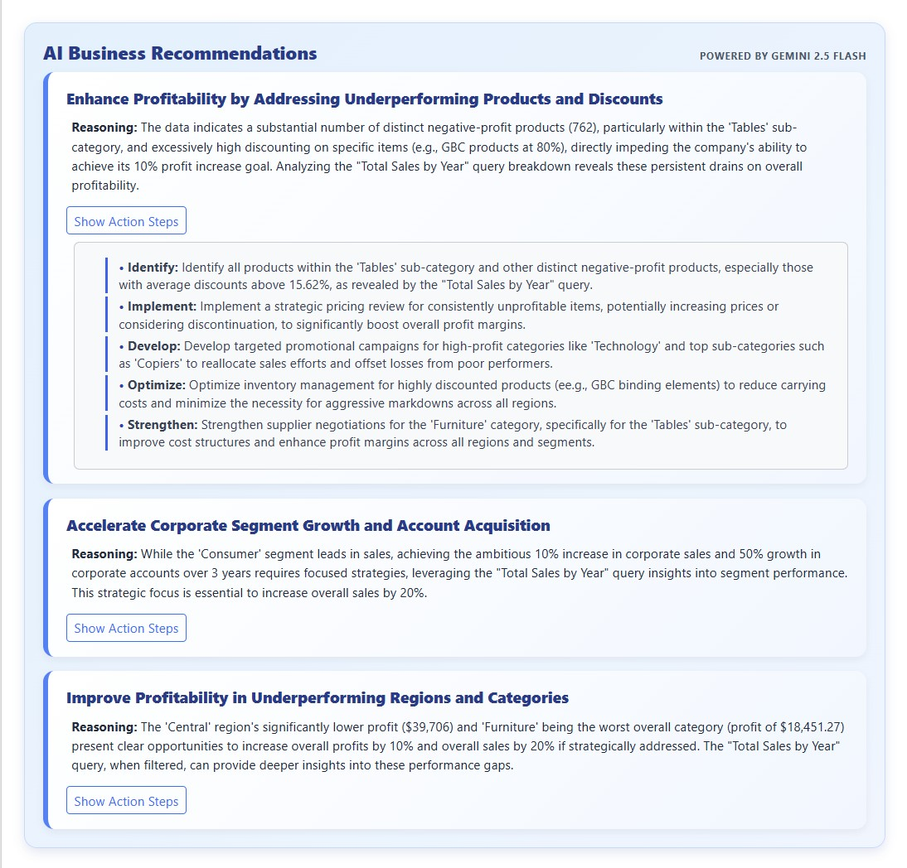
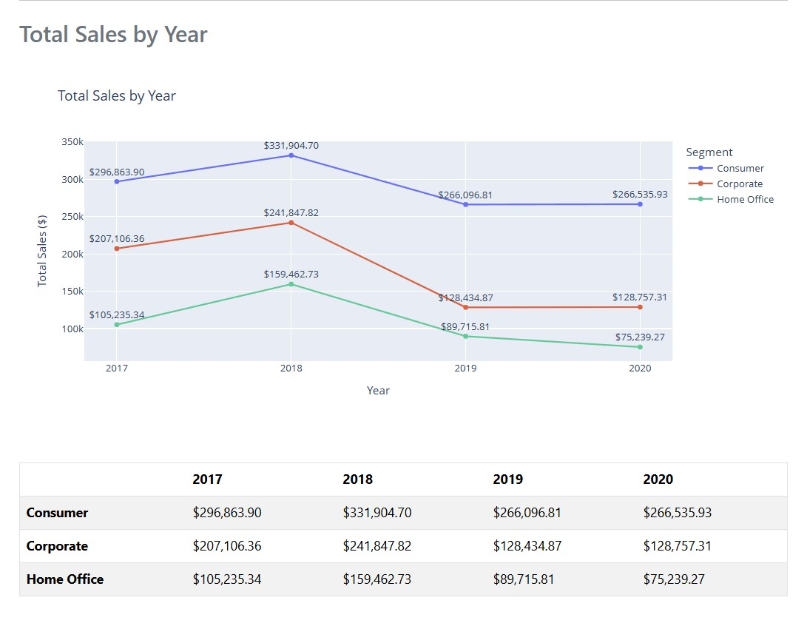
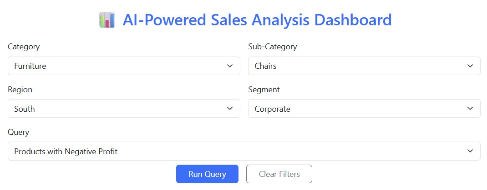
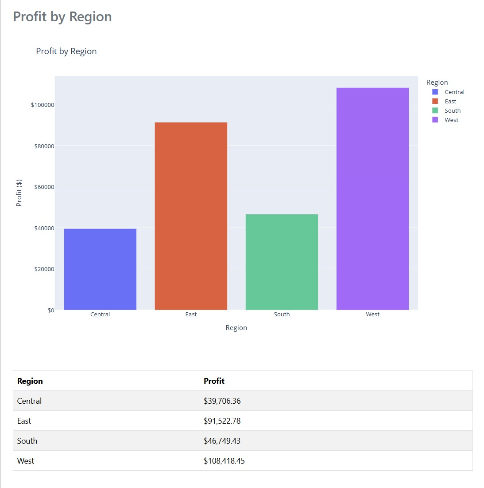

# AI-Powered Sales Analysis with LLM-Powered Recommendations
* This project is an interactive Flask web app for analyzing sales data.  
* It includes filters, predefined queries, charts, tables, and AI-generated business recommendations.

---

---

## How to Run

1. Install the required packages:
pip install -r requirements.txt

2. Create a .env file in the same folder as app.py that contains:
GEMINI_API_KEY=YOUR_API_KEY_HERE

3. Run the app in your terminal:
python app.py

4. Open in your browser:
http://127.0.0.1:5000

---

## Dataset Used
The dataset used in this project is **TableauSalesData.csv**, which contains orders, sales, profit, discounts, regions, segments, categories, and sub-categories.

---

# LLM Prompt & Design Rationale
This project uses Google Gemini 2.5 Flash to generate 3 business recommendations after each query.

To ensure clear, actionable, and consistent results, the prompt is structured with:

* A concise summary of the filtered dataset (sales, profits, discounts, segments, regions).
* Explicit goals from Office Solutions (increase sales/profits, grow corporate accounts).
* A required output format: 3 numbered recommendations, each with a “Reasoning” section and “Action Steps.”
* A rule that each action step must start with a business verb (e.g., Identify, Implement, Optimize).

This structure helps the LLM stay focused on data-driven insights and avoids generic or off-topic responses.

---

---

# API Choice
This project uses:
* Google Gemini 2.5 Flash (Free Tier)
* Obtained from Google AI Studio: https://ai.google.dev
* Called through a simple requests.post() API call

---

---
